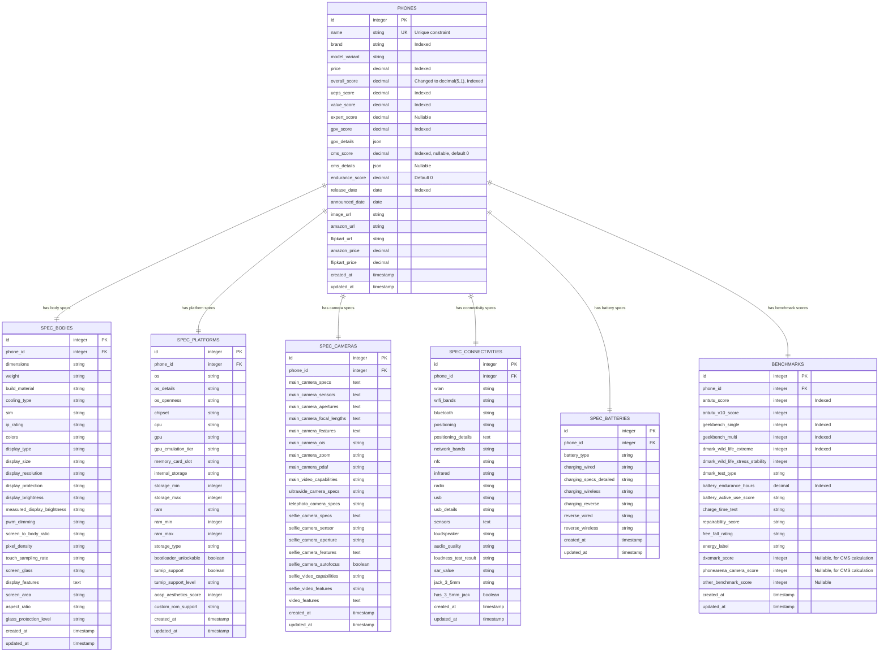
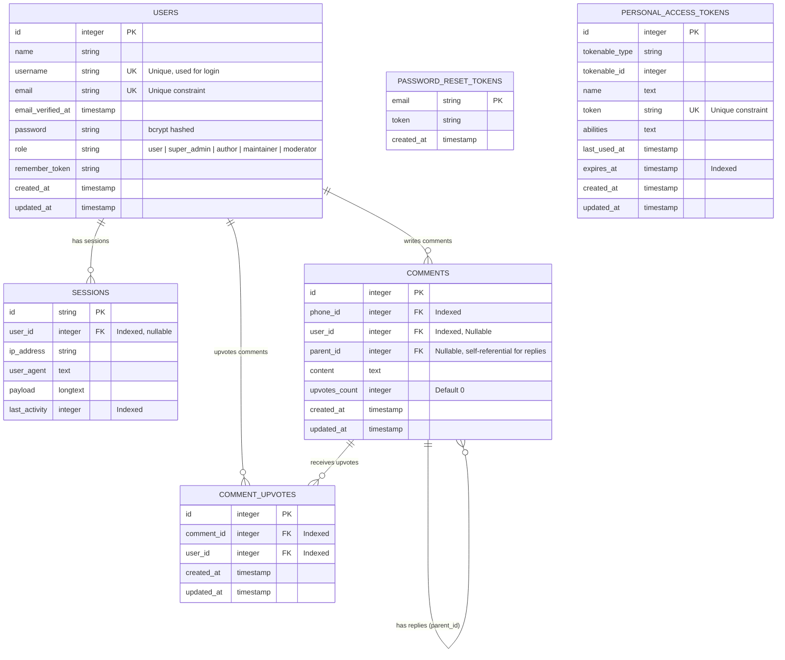
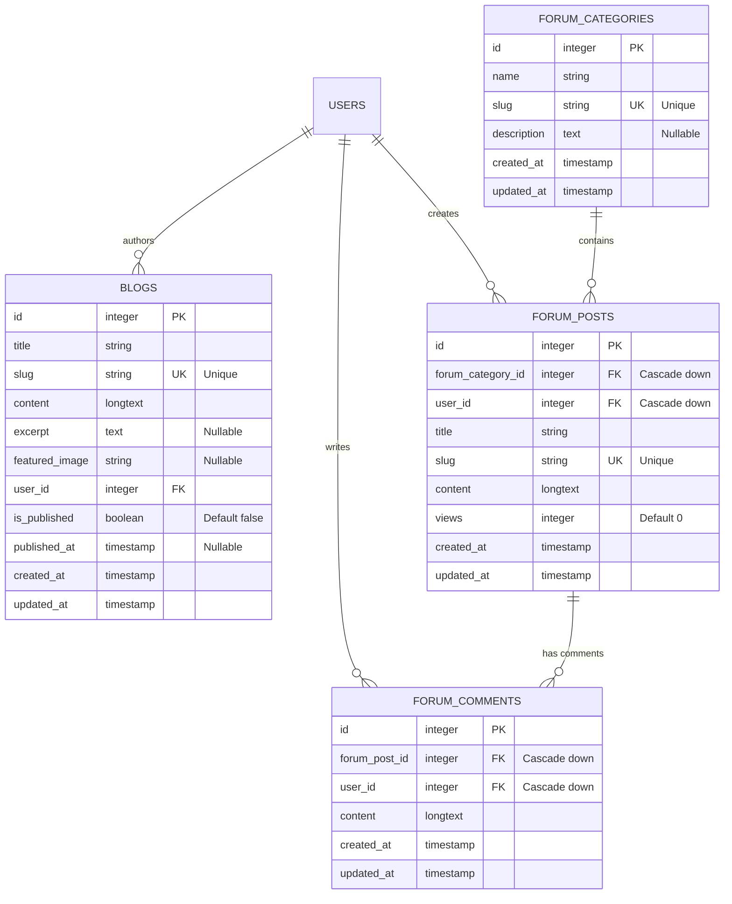
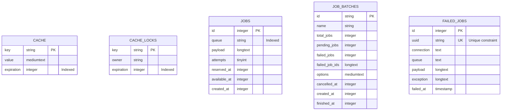

# Phone Finder - Entity Relationship Diagram

This diagram represents the complete database schema for the Phone Finder Hub application, including all tables, columns, relationships, indexes, and constraints.

## Core Application Tables

## Authentication & Session Tables

## Community & Content Tables (Blogs & Forums)

## System Tables (Cache & Jobs)

## Schema Summary

### Total Tables: 17

#### Core Application Tables (7):
1. **phones** - Main phone records with pricing, scores, and metadata
2. **spec_bodies** - Physical specifications and display details
3. **spec_platforms** - OS, chipset, and developer freedom metrics
4. **spec_cameras** - Camera specifications for main, ultrawide, telephoto, and selfie
5. **spec_connectivities** - Network, connectivity, and audio specifications
6. **spec_batteries** - Battery capacity and charging specifications
7. **benchmarks** - Performance benchmarks and test results

#### Authentication & Engagement Tables (4):
8. **users** - User accounts with `username` (unique login handle), `role` (user | super_admin | author | maintainer | moderator)
9. **password_reset_tokens** - Password reset functionality
10. **sessions** - User session management
11. **personal_access_tokens** - API token authentication
12. **comments** - User comments on phones
13. **comment_upvotes** - Upvotes on comments

#### Community & Content Tables (4):
14. **blogs** - Articles written by authors/admins
15. **forum_categories** - High level categories for forum discussions
16. **forum_posts** - User-created discussion threads
17. **forum_comments** - Replies to forum posts

#### System Tables (2):
18. **cache** & **cache_locks** - Application caching
19. **jobs**, **job_batches**, **failed_jobs** - Queue management

### Key Relationships

- **One-to-One**: Each phone has exactly one record in each spec table (bodies, platforms, cameras, connectivities, batteries, benchmarks)
- **Cascade Deletion**: All spec tables use `onDelete('cascade')` - deleting a phone removes all related specs
- **Foreign Keys**: All spec tables reference `phones.id` via `phone_id`

### Indexes

**phones table:**
- `name` (unique)
- `overall_score`, `ueps_score`, `value_score`, `gpx_score`, `cms_score`
- `price`, `release_date`

**benchmarks table:**
- `antutu_score`, `geekbench_single`, `geekbench_multi`
- `dmark_wild_life_extreme`, `battery_endurance_hours`

### Notable Schema Features

1. **Scoring System**: Multiple scoring metrics (overall_score, ueps_score, value_score, expert_score, gpx_score, cms_score, endurance_score) with gpx_details and cms_details stored as JSON
2. **CMS-1330 Camera Scoring**: Dedicated cms_score (0-1330) and cms_details (JSON breakdown) for comprehensive camera evaluation
3. **Camera Benchmarks**: DxOMark, PhoneArena, and other camera scores stored in benchmarks table for CMS calculation
4. **E-commerce Integration**: Amazon and Flipkart URLs and prices
5. **Developer Metrics**: Bootloader unlock, custom ROM support, Turnip support for gaming
6. **Comprehensive Camera Specs**: Separate fields for main, ultrawide, telephoto, and selfie cameras
7. **Detailed Display Specs**: Both claimed and measured brightness values
8. **Multiple Benchmark Types**: AnTuTu, Geekbench, 3DMark with stability testing
9. **Charging Specs**: Detailed wired, wireless, and reverse charging specifications
10. **Thermal Management**: Cooling type tracking for performance analysis
11. **Storage Variants**: RAM and storage min/max fields for tracking multiple configurations
