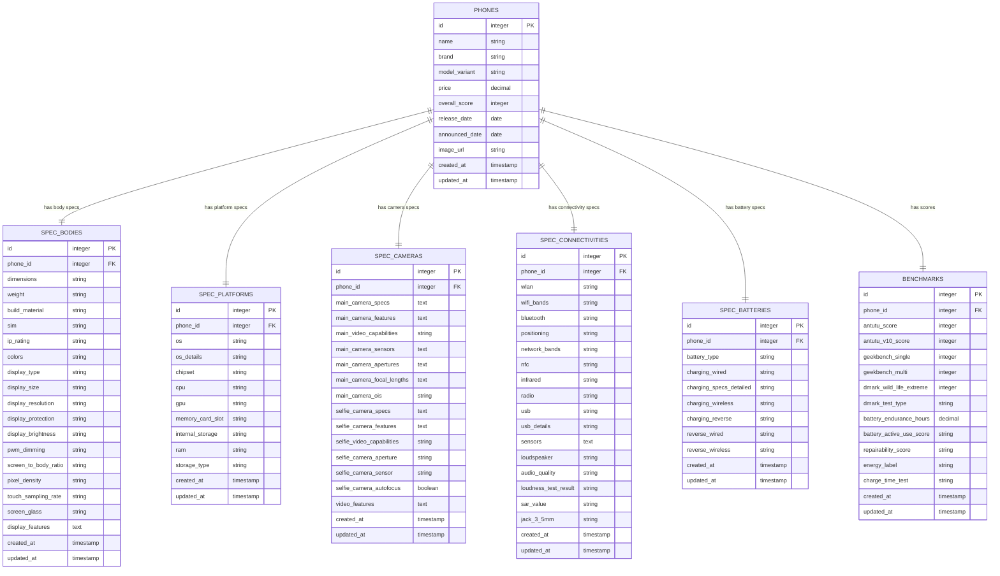

# Phone Finder - Entity Relationship Diagram

```mermaid
erDiagram
    PHONES {
        id integer PK
        name string
        brand string
        model_variant string
        price decimal
        overall_score integer
        release_date date
        announced_date date
        image_url string
        created_at timestamp
        updated_at timestamp
    }

    SPEC_BODIES {
        id integer PK
        phone_id integer FK
        dimensions string
        weight string
        build_material string
        sim string
        ip_rating string
        colors string
        display_type string
        display_size string
        display_resolution string
        display_protection string
        display_brightness string
        pwm_dimming string
        screen_to_body_ratio string
        pixel_density string
        touch_sampling_rate string
        screen_glass string
        display_features text
        created_at timestamp
        updated_at timestamp
    }

    SPEC_PLATFORMS {
        id integer PK
        phone_id integer FK
        os string
        os_details string
        chipset string
        cpu string
        gpu string
        memory_card_slot string
        internal_storage string
        ram string
        storage_type string
        created_at timestamp
        updated_at timestamp
    }

    SPEC_CAMERAS {
        id integer PK
        phone_id integer FK
        main_camera_specs text
        main_camera_features text
        main_video_capabilities string
        main_camera_sensors text
        main_camera_apertures text
        main_camera_focal_lengths text
        main_camera_ois string
        selfie_camera_specs text
        selfie_camera_features text
        selfie_video_capabilities string
        selfie_camera_aperture string
        selfie_camera_sensor string
        selfie_camera_autofocus boolean
        video_features text
        created_at timestamp
        updated_at timestamp
    }

    SPEC_CONNECTIVITIES {
        id integer PK
        phone_id integer FK
        wlan string
        wifi_bands string
        bluetooth string
        positioning string
        network_bands string
        nfc string
        infrared string
        radio string
        usb string
        usb_details string
        sensors text
        loudspeaker string
        audio_quality string
        loudness_test_result string
        sar_value string
        jack_3_5mm string
        created_at timestamp
        updated_at timestamp
    }

    SPEC_BATTERIES {
        id integer PK
        phone_id integer FK
        battery_type string
        charging_wired string
        charging_specs_detailed string
        charging_wireless string
        charging_reverse string
        reverse_wired string
        reverse_wireless string
        created_at timestamp
        updated_at timestamp
    }

    BENCHMARKS {
        id integer PK
        phone_id integer FK
        antutu_score integer
        antutu_v10_score integer
        geekbench_single integer
        geekbench_multi integer
        dmark_wild_life_extreme integer
        dmark_test_type string
        battery_endurance_hours decimal
        battery_active_use_score string
        repairability_score string
        energy_label string
        charge_time_test string
        created_at timestamp
        updated_at timestamp
    }

    PHONES ||--|| SPEC_BODIES : "has body specs"
    PHONES ||--|| SPEC_PLATFORMS : "has platform specs"
    PHONES ||--|| SPEC_CAMERAS : "has camera specs"
    PHONES ||--|| SPEC_CONNECTIVITIES : "has connectivity specs"
    PHONES ||--|| SPEC_BATTERIES : "has battery specs"
    PHONES ||--|| BENCHMARKS : "has scores"
```
